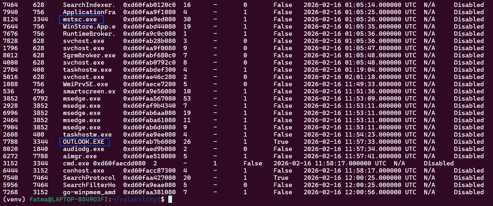
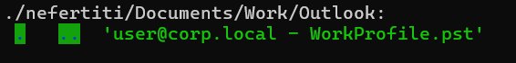
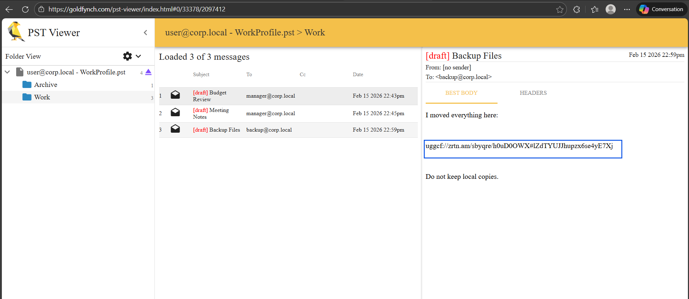
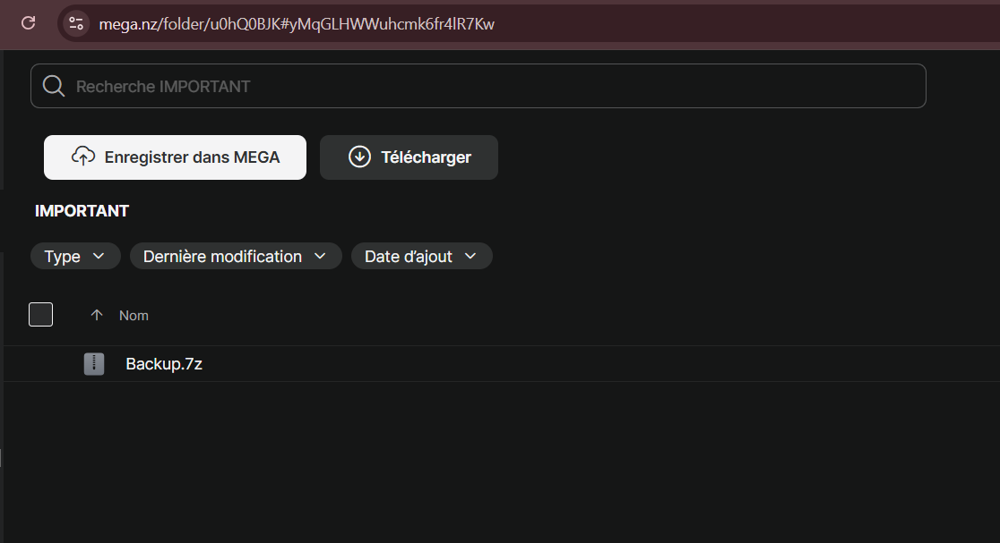
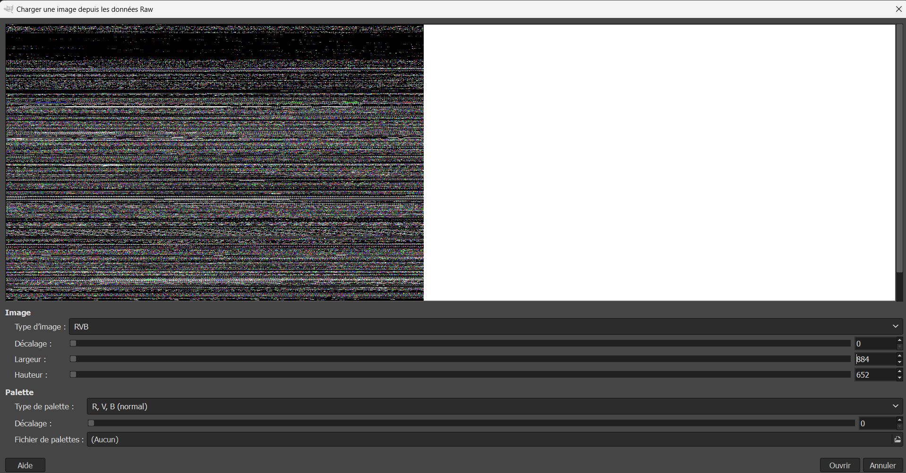
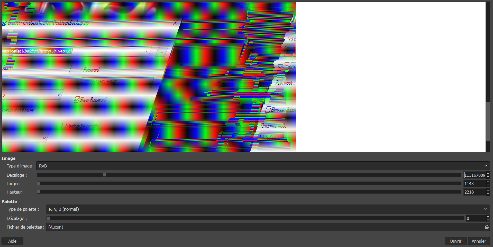
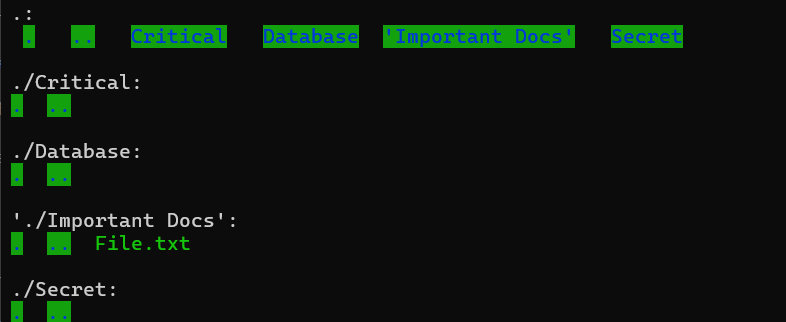
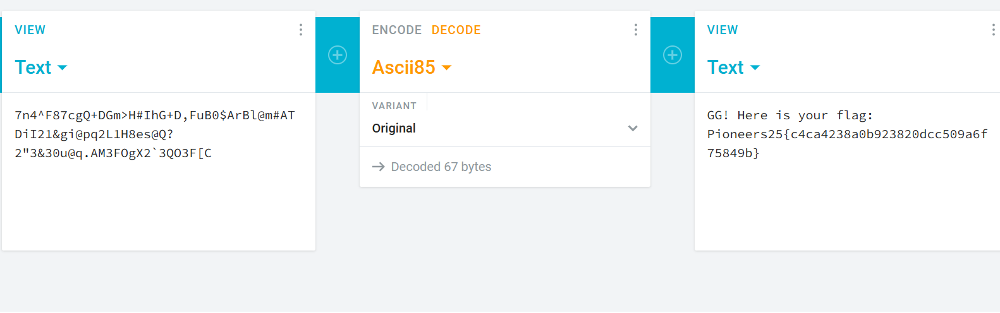

# Donna Challenge Writeup

## Overview

In this challenge, we are given:

-   A Windows memory dump
-   A copy of the Donna's user files

No further instructions.

------------------------------------------------------------------------

## Memory Analysis

We begin by analyzing the memory dump using **Volatility 3**.

``` bash
python3 vol.py -f memory.raw windows.pslist
```



From the process list, two processes immediately stand out:

-   `OUTLOOK.EXE`
-   `mstsc.exe` (Remote Desktop Client)

These two processes are clearly relevant.

------------------------------------------------------------------------

## Investigating the User Files

Since Outlook was running, we return to the Donna's files and search
for Outlook-related artifacts.



We locate a `.pst` file inside the user directory.
This is an Outlook Personal Storage Table file containing emails and
drafts.

------------------------------------------------------------------------

## Extracting Emails from the PST

We open the `.pst` file using an online PST viewer:

https://goldfynch.com/pst-viewer/index.html

Inside, we find some draft emails. One of them looks useful:



    uggcf://zrtn.am/sbyqre/h0uD0OWX#lZdTYUJJhupzx6se4yE7Xj

This clearly looks like **ROT13**.

------------------------------------------------------------------------

## Decoding the Link

Decoding the string using ROT13 gives:

    https://mega.nz/folder/u0hQ0BJK#yMqGLHWWuhcmk6fr4lR7Kw



Visiting the link leads to a **password-protected ZIP archive**.

------------------------------------------------------------------------

## Archive Analysis

We download the 7z file.

Attempts to crack the password fail --- it is clearly strong and not
brute-forceable.

So we need to find the password elsewhere.

At this point, we remember that `mstsc.exe` (Remote Desktop) was running
in memory.

This suggests the password may have been typed during a remote session.

------------------------------------------------------------------------

## Dumping mstsc.exe

We dump the `mstsc.exe` process using Volatility 3:

``` bash
python3 vol.py -f memory.raw -o mstsc_dump windows.memmap --pid 8124 --dump
```


To analyze graphical artifacts we:

1.  Rename the dumped file extension to `.data`
2.  Open it using **GIMP**



3.  Adjust width, height, and offset until meaningful screen data
    appears

------------------------------------------------------------------------

## Recovering the Password from Screen Data

After adjusting parameters and scrolling carefully, we locate a rendered
screen capture of the remote session showing the ZIP password being
typed.



The password is:

    kD9FLxP7@Q2zM8#

------------------------------------------------------------------------

## Extracting the ZIP

Using the recovered password, we unzip the archive.

Inside, we find:

-   Several empty folders
-   `File.txt` file



The file contains:

    7n4^F87cgQ+DGm>H#IhG+D,FuB0$ArBl@m#ATDiI21&gi@pq2L1H8es@Q?2"3&30u@q.AM3FOgX2`3QO3F[C

This appears to be encoded text.

------------------------------------------------------------------------

## Decoding the Final Message

After some decoding attempts, we identify the encoding as **Base85**.

Using any online Base85 decoder, we obtain:



    GG! Here is your flag:
    Pioneers25{{c4ca4238a0b923820dcc509a6f75849b}}

------------------------------------------------------------------------

## Final Flag

    Pioneers25{{c4ca4238a0b923820dcc509a6f75849b}}

------------------------------------------------------------------------
