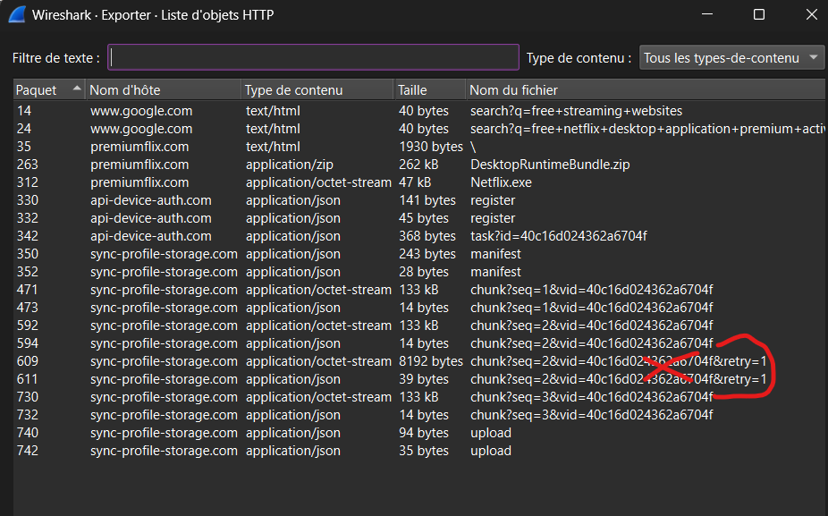

# Net-flix 

## Scenario 

A user (**nefertiti**) searches for free streaming platforms and downloads a **"Netflix Premium Desktop"** application from:

```
premiumflix.com
```

The binary executes, establishes command-and-control (C2) communication, deploys persistence, and exfiltrates sensitive data.


---

# Net-flix 0 : Welcome

## Question
What is the SHA256 of the provided PCAP?

## Solution
```bash
sha256sum net-flix.pcap
```

## Answer
```
Pioneer25{939cee58600c8ccedaf52a60a18cf33ad918c6e0b890c3493b66de5d6a9f4688}
```

---

# Net-flix 1 : Victim Identification

## Question
What are the IP and MAC address of the victim machine?

## Solution
Identify the source IP address in the packet that contains the search query, then use that information to determine the IP and corresponding MAC address of the victim machine.

## Answer
```
Pioneer25{192.168.1.137_3c:52:82:4a:91:b7}
```

---

# Net-flix 2 : Initial Access (Delivery)

## Question
Which host delivered the malicious file?

## Solution
Filter HTTP traffic:

```
http
```

Look for file download.

## Answer
```
Pioneer25{premiumflix.com}
```

---

# Net-flix 3 : Malware File

## Question
What is the SHA256 of the malicious file?

## Solution
Export object in Wireshark:

```
File → Export Objects → HTTP
```

Then hash:

```bash
sha256sum Netflix.exe
```

## Answer
```
Pioneer25{bc7359588281d12e7bb8dc80595267955910c4cf12e24e2dc6b85505ff06cd47}
```

---

# Net-flix 4 : First Contact

## Question
What IP address is first contacted by the malware over TCP port 80?

## Solution
The ip is not in the pcap so we need to find it through the malware file.
We upload it to a malware analysis website and see its relations.

## Answer
```
Pioneer25{104.21.22.102}
```

---

# Net-flix 5 : Network Behavior

## Question
What is the most frequently contacted domain?

## Solution
Wireshark:

```
dns
```

## Answer
```
Pioneer25{allnaturalandorganic.com}
```

---

# Net-flix 6 : Privilege Manipulation

## Question
Which Windows API is used for privilege manipulation?

## Answer
```
Pioneer25{AdjustTokenPrivileges}
```

---

# Net-flix 7 : Process Injection

## Question
What suspicious memory-related technique is used?

## Answer
```
Pioneer25{WriteProcessMemory}
```

---

# Net-flix 8 : Persistence

## Question
What persistence mechanism is used?

## Answer
```
Pioneer25{ScheduledTask}
```

---

# Net-flix 9 : Malware Family

## Question
To what malware family does the sample belong?

## Answer
```
Pioneer25{AsyncRAT}
```

---

# Net-flix 10 : Victim Id

## Question
What victim identifier is reused across registration, tasking, and exfiltration?

## Solution
Search in HTTP traffic:

```
frame contains "id"
```

## Answer
```
Pioneer25{40c16d024362a6704f}
```

---

# Net-flix 11 : Tasking Phase

## Question
What endpoint delivers the tasking instructions?

## Answer
```
Pioneer25{/api/v1/task}
```

---

# Net-flix 12 : Exfiltration

## Question
Which host received the final exfiltration upload?

## Answer
```
Pioneer25{sync-profile-storage.com}
```

---

# Net-flix 13 : Submission URI

## Question
What URI path handled the final archive submission?

## Answer
```
Pioneer25{/sync/v2/profile/upload}
```

---

# Net-flix 14 : Archive Reconstruction

## Question
What is the SHA256 of the reconstructed uploaded archive?

## Solution

1. Identify chunks:

```
/sync/v2/profile/chunk
```

2. Extract only accepted chunks (that do not show a retry) :



3. Rebuild archive.zip from the extracted chuncks.


4. Hash:

```bash
sha256sum archive.zip
```

## Answer
```
Pioneer25{58f045119110e52d6bf67ac8bd379a0a2b06d195647d411fe4e0ecba0213d617}
```

---

# Net-flix 15 : Exfiltrated File

## Question
What critical file did the attacker exfiltrate?

## Answer
```
Pioneer25{payment_profiles.enc}
```

---

# Net-flix 16 : Data Decryption

## Question
What are the credit card number and security code extracted from the exfiltrated data?

## Solution

1. Extract file:
```
payment_profiles.enc
```

2. Decode layers:

```
XOR → Base64 → Gzip
```

We open the decrypted file and get the card number and security code.

```

## Answer
```
Pioneer25{4868719196829038_344}
```

---

