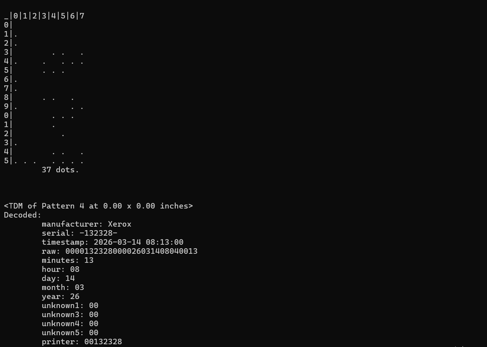

# Night Agent

## Challenge Description

We are given a scanned confidential document and asked:

> Recover the exact **time of the leak**

Flag format:
```
Pioneers25{DD-MM-YYYY_HH:MM}
```

---

## Understanding the Challenge

The key idea is to interpret what “time of the leak” means.

Since the file is a **scanned document**, the leak most likely happened when the document was:
- printed

So the **print time = leak time**

This means we need a way to recover **printer metadata from the document**.

---

## Step 1: Research printing artifacts

Modern color printers embed hidden patterns called:

### Yellow Tracking Dots

These are tiny, almost invisible yellow dots printed on documents that encode:

- printer serial number
- date and time of printing

They are used for forensic tracking of printed documents.

You can read more about it here:
https://regulaforensics.com/blog/printer-tracking-dots/

---

## Step 2: Find a tool to decode them

We find a tool specifically designed for this purpose:

### DEDA (Document Exploit & Detection Analyzer)

GitHub:
https://github.com/dfd-tud/deda

What it does:
- detects printer tracking dots
- extracts encoded metadata
- reconstructs print timestamp and printer information

---

## Step 3: Extract the print data

We run:

```bash
deda_parse_print document.png
```

The tool outputs:

- printer model
- serial number
- **timestamp of printing**



We obtain:

```
2026-03-14 08:13
```

---

## Step 4: Format the flag

Convert to required format:

```
DD-MM-YYYY_HH:MM
```

---

## Final Flag

```
Pioneers25{14-03-2026_08:13}
```

---

## Final Notes

This challenge is based on real-world forensic techniques using printer tracking dots.

It was inspired by a scene in *The Night Agent* (Season 2, Episode 6), where investigators decode Yellow Tracking Dots of some confidential leaked documents to trace a printer’s serial number, identify its location through a database of registered devices, and use surveillance footage to find who was the leaker.


